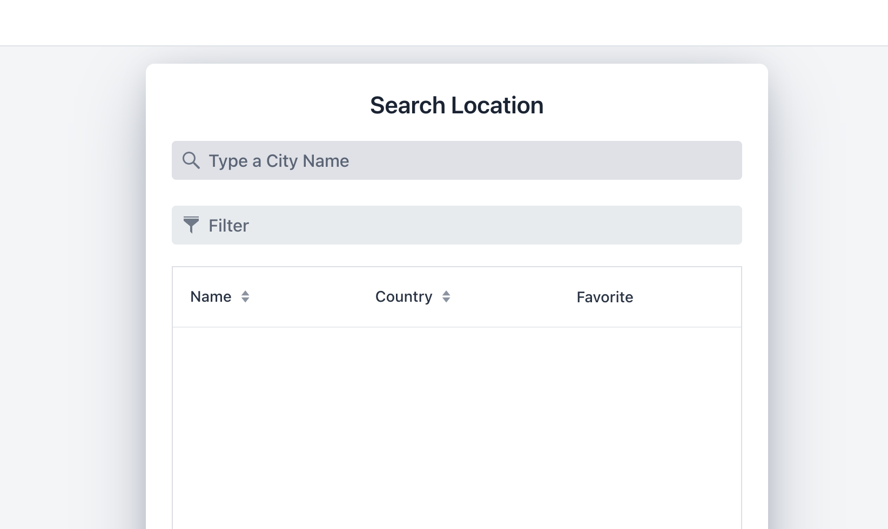

# Weather Application

This is the job interview task for software developer position

## What to do
* Fork the repository
* After work is done, make a pull request and notify me by email

## Task description
You need to use the Weather API provided here https://open-meteo.com/en to make the weather application. 
1. Call the API to get the locations by city name. Make the paging available with 10 items per page and a filter to filter by location name.
2. When clicked on the location it should show the weather forecast for the location with the temperature, surface wind and rain hourly. The interface should let you first see the daily forecast and when clicked it then should show the forecast hourly for the day you selected.
3. If you UI contains a chart it is a bonus. The interface should be convenient for user and rely on best usability and design practises
4. Only logged on users should be able to see the weather forecasts.
5. User should be able to mark the location favourite and have the favourite location list for quick access.

All the other specific requirements are up to you

## Technical requirements
* Use  Vaadin (https://vaadin.com/) framework for the frontend. For chart you may use some different framework
* For backend use Java EE
* Use any database (Postgres, Oracle, etc.)
* Make a Maven project

## Main points
* Structure your code
* Use best practises
* Use naming conventions
* Show understanding of software development concepts

# Weather Forecast - Application Guide

### Environment prerequisites for host machine

1. JDK 17 installed with proper setup
2. Docker engine available

### Application run as (dev) environment mode

1. Clone the project from [Git Hub](https://github.com)
2. Open terminal at the project root directory
3. Run the below command (h2 db will run here files location target folder)
```shell
  ./mvnw spring-boot:run -Dspring-boot.run.profiles=dev -Dspring-boot.run.arguments="--server.port=8080"
```
4. Browse to [http://localhost:8080](http://localhost:8080)


### Application run as (prod) environment mode

1. Run docker engine first in your host machine
2. Clone the project from [Git Hub](https://github.com)
3. Open two terminal (for run 4, 5) at the project root directory
4. Run the below docker command first to prepare postgres sql server

```shell
  docker-compose -f src/main/docker/pgsql.yml up
```

6. Run the below command
```shell
  ./mvnw spring-boot:run -Dspring-boot.run.profiles=prod -Dspring-boot.run.arguments="--server.port=8080"
```

7. Browse to [http://localhost:8080](http://localhost:8080)

### Application functionality

1. Application has some default preloaded users like below you can use any of them.

```
| username | password    
| ---------+----------
|   user   |  1234
|   salman |  1234
```

2. Public default page will be loaded when user hit [http://localhost:8080](http://localhost:8080)  and a
   location search  and filter interface will be visible both for logged-in and not logged-in users.

| Picture 1               | Picture 2               | Picture 3               |
|-------------------------|-------------------------|-------------------------|
|  |  |  |

3. In search field after typing any city(location) name, location list will be
   loaded with city | Name | Country | Favourite | column.

4. If user click any row of the list, weather forecast of that location will be shown, if user already logged-in.
5. If user click on favourite icon that location will be listed as favourite location of that user, if user already logged-in.

6. So after log in user moves to profile page which contains favourite location list on left
   side and detailed forecast on right side if user has any selected favourite location on the
   left side list like below.
   
7. After selecting any location right side top-bar UI will show full week forecast summery
   according to week days.
   
8. By default, current day will be selected and detailed different information will be shown
   below UI blocks.
   
9. Finally, at right bottom hourly information of selected day will be shown in a table .
   
10. Any selection of location or day, detailed weather forecast will be shown dynamically like below full view.   
    
    11.At left side Location list, if user click on [X] button that item will be deleted from user's favourite list and only logged-in user's favorite list will be shown here.

### Not done list
1. Test code writing
2. Chart not implemented

### Finally, happy coding

